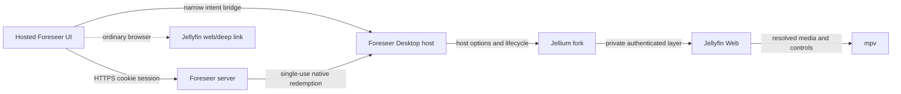

# Foreseer Desktop Integration Plan

Status: Phases 1–3 implemented; Phase 4 session bootstrap and Phase 5 native
playback lifecycle are implemented as validated slices. Packaging, cross-
platform soak testing, and later shell polish remain in progress.

## Goal

Deliver one Foreseer product that behaves correctly in both environments:

- In an ordinary browser, Foreseer remains a complete web application and play actions keep using normal Jellyfin links.
- In Foreseer Desktop, the same hosted Foreseer UI detects a versioned native capability bridge, reuses the signed-in Foreseer user's linked Jellyfin identity, and plays through Jellium/mpv in the same window.
- When playback ends or the user goes back, the exact Foreseer page and navigation state reappear without exposing the hidden Jellyfin Web UI.
- The desktop window has normal application lifecycle behavior: close, quit, minimize, maximize, fullscreen, navigation shortcuts, startup restore, error recovery, and eventually packaged updates.

Foreseer Desktop and the maintained Jellium fork are the supported native stack. The immediate goal is product stability, not minimizing the fork for an upstream pull request.

## Non-goals

- Do not move the Foreseer product into Jellium.
- Do not reproduce Jellyfin Web's playback negotiation in Foreseer.
- Do not expose mpv, filesystem, shell, CEF handles, or Jellyfin tokens to the hosted page.
- Do not make the browser build depend on the desktop binary.
- Do not require users to configure the same Jellyfin server twice.
- Do not require a second top-level application window for playback.

## Current Baseline

The proof of concept already establishes the difficult rendering path:

- `foreseer-desktop` starts the Jellium runtime with an external frontend URL.
- Jellium creates a Foreseer CEF layer above its normal Jellyfin Web layer.
- The allowlisted external page receives only `window.jelliumHost.playItem(itemId)`.
- Jellyfin Web resolves the item and controls mpv.
- Jellium swaps the visible layer for playback and restores Foreseer on terminal playback events.
- The compositor fix unmaps a hidden GPU-painted layer so mpv can actually become visible.
- CEF Chromium GPU compositing stays enabled even when shared-texture (dmabuf) presentation falls back to CPU/GPU upload. Shared textures are a host paint path; `--disable-gpu-compositing` is an explicit CLI/settings opt-out only. UI CSS (`backdrop-blur`, transforms) needs the Chromium compositor.

The remaining architectural gap is identity and lifecycle. Foreseer authenticates with a 30-day HTTP-only session cookie and stores the linked user's Jellyfin token server-side. The hidden Jellyfin Web layer currently keeps a separate login/profile, which caused the extra server and login prompts during the proof of concept.

## Target Ownership

| Concern | Primary owner | Notes |
| --- | --- | --- |
| Hosted discovery, requests, routes, universal play UI | SeerrSuggestArr | Must work unchanged in a normal browser. |
| Native capability context and browser fallback decision | SeerrSuggestArr | Wrap the injected bridge; do not scatter global checks through components. |
| Desktop bootstrap, config, policy, release pinning | foreseer-desktop | Own the Foreseer URL, profile paths, logging policy, and product defaults. |
| CEF layers, hidden Jellyfin session, mpv, compositor, native window | Jellium fork | These are native runtime invariants. |
| One-time credential exchange | SeerrSuggestArr server + foreseer-desktop | The page initiates it; only the native process receives credentials. |
| Jellyfin playback negotiation and reporting | Jellyfin Web through Jellium | Preserve its player/session behavior instead of reimplementing it. |

## Target Runtime



The external Foreseer layer is the application UI. The Jellyfin Web layer is a private playback controller and must never become a second general-purpose UI during normal operation.

Owned-media browsing lives in Foreseer web (`/library`, `/api/v1/library/*`): Continue Watching, Recently Added, Recently Added Episodes, Ready to Watch, and available-title search use the user-linked Jellyfin token on the Foreseer server. Series Play resolves to a concrete episode id (resume → next unwatched → rewatch S1E1); series card click opens an in-Library season/episode panel with View details → `/tv/{tmdbId}`. Native desktop remains play-only (`playItem`); it does not list library contents and must not surface hidden Jellyfin Web for browsing.

## 1. Versioned Native Capability Contract

Keep the injected global generic to the runtime: `window.jelliumHost`. Add a versioned, frozen capability description rather than relying only on a user-agent string or a truthy global.

Proposed shape:

```ts
interface JelliumHostV1 {
  readonly protocolVersion: 1;
  readonly hostName: 'jellium-desktop';
  readonly hostVersion: string;
  readonly capabilities: readonly (
    | 'play-item'
    | 'auth-bootstrap'
    | 'player-events'
    | 'window-controls'
    | 'quit'
  )[];
  requestAuthChallenge(requestId: string): boolean;
  // Protocol v1 is intentionally two-argument. Jellyfin owns resume policy.
  playItem(requestId: string, itemId: string): boolean;
  completeAuth(requestId: string, ticket: string): boolean;
  clearSession(requestId: string): boolean;
  minimize(): boolean;
  toggleMaximize(): boolean;
  toggleFullscreen(): boolean;
  quit(): boolean;
}
```

Rules:

- Inject the bridge before Foreseer application JavaScript runs.
- Install it only in the external browser profile.
- Validate the current main-frame origin on every native call, not only at bridge creation.
- Validate argument size and syntax in Rust.
- Return only immediate admission (`true` or `false`) synchronously. Report actual results asynchronously.
- Send sanitized state to the page through the generic versioned `jellium:host-event`, containing `protocolVersion`, `requestId`, `type`, and a constrained payload.
- Never put a credential, media URL, local path, raw mpv error, or private server response in an event.

### Web detection

Add a single `NativeRuntimeProvider` and `useNativeRuntime()` hook in SeerrSuggestArr. It owns these states:

- `web`: no compatible bridge; render normal links.
- `probing`: compatible bridge found, runtime state not known yet.
- `authenticating`: native credential bootstrap in progress.
- `ready`: native playback can accept commands.
- `degraded`: app exists but native playback is unavailable; retain web fallback.
- `playing`: playback accepted or active.

Server-side rendering must assume `web`. After hydration, the provider inspects the version and capabilities. Components consume the context; they must not read `window.jelliumHost` directly.

Detection is a UX decision, not a security boundary. Native Rust origin checks remain authoritative even if a page scripts a fake global.

### Rust host boundary

Do not put Foreseer HTTP policy or endpoint knowledge into Jellium. Extend `HostOptions` with a bounded host-service callback/channel owned by Foreseer Desktop:

- Jellium forwards `requestAuthChallenge(requestId)` to the host service and emits the returned public challenge as a safe native event.
- Jellium forwards `completeAuth(requestId, ticket)` to the host service without blocking the CEF UI thread.
- Foreseer Desktop owns the verifier, Foreseer endpoint construction, TLS request, timeout, and redemption response validation.
- The host service returns a typed `JellyfinSessionBootstrap` to Jellium over an internal Rust boundary. Jellium necessarily receives the credential in native memory because its private Web layer consumes it, but it does not persist or log it.
- Jellium owns installation into the hidden Jellyfin session, player readiness, surface transitions, and native shutdown.
- The generic `session-reset` capability clears the private Jellyfin identity and pending playback; Foreseer Desktop also rotates its in-memory verifier when it receives that intent.

Use a dedicated worker or bounded channel with cancellation rather than calling the network from a CEF callback. Ensure shutdown cancels outstanding redemption and cannot deadlock on the worker.

## 2. Universal Play Actions

Replace URL-only button data with structured play intent while retaining a fallback URL:

```ts
type PlayTarget = {
  provider: 'jellyfin' | 'emby' | 'plex' | 'trailer';
  itemId?: string;
  fallbackUrl: string;
  label: string;
  quality: 'standard' | '4k' | 'trailer';
};
```

Behavior:

- In `web`, render an ordinary anchor and preserve the current new-tab/deep-link behavior.
- In `ready`, intercept only supported Jellyfin targets, send the structured item ID to the native host, and keep the current route untouched.
- In `probing` or `authenticating`, allow the user to click but show a bounded connecting state; queue at most one play intent.
- In `degraded`, show the normal web link plus a concise explanation that native playback is unavailable.
- Never derive the Jellyfin item ID by parsing a presentation URL. Use `mediaInfo.jellyfinMediaId` or `jellyfinMediaId4k` directly.
- Keep trailers and unsupported providers on their existing browser behavior unless a later capability explicitly supports them.

Apply the abstraction to every playback entry point, not only movie and series detail pages. Audit at least the shared Play button, calendar watch actions, episode actions, 4K variants, external-link blocks, search/discovery cards, and future continue-watching surfaces.

### Command lifecycle

Each play request receives a random request ID. Native events progress through:

`accepted -> resolving -> starting -> playing -> stopped | finished | canceled | error`

Ignore stale events from an older request. Disable accidental double-clicks while resolving, but allow an explicit replacement request after canceling the previous one.

## 3. Shared Authentication Without Token Exposure

### Principles

- The Foreseer HTTP-only cookie remains the user's primary desktop login.
- Foreseer remains the source of truth for the linked Jellyfin account and configured server.
- The hosted page must never receive `jellyfinAuthToken` or `jellyfinDeviceId`.
- The native binary must not scrape cookies or ask the user for their Jellyfin password.
- A local database/config file must not contain a second long-lived copy of the Jellyfin token.

### Challenge-bound one-time exchange

Use a challenge-bound, single-use ticket:

1. At process start, Foreseer Desktop generates a random 32-byte verifier and keeps it only in native memory.
2. The page requests a challenge through the bridge; native emits only `SHA-256(verifier)` as a safe event.
3. Once the Foreseer page has an authenticated cookie session, it sends `POST /api/v1/desktop/auth-tickets` with that challenge and the bridge protocol version. Existing CSRF protection applies.
4. The server verifies the Foreseer user, ensures that the account is linked to the configured Jellyfin server, and stores a random ticket digest with the user ID, challenge, creation time, expiry, and unused status.
5. The endpoint returns only an opaque random ticket with a 30–60 second lifetime.
6. The page passes the opaque ticket to `window.jelliumHost.completeAuth(...)`.
7. The native host redeems it directly over HTTPS with the ticket and the original verifier.
8. The server atomically checks the ticket digest, challenge, expiry, user/session status, and unused state, then marks it consumed.
9. The redemption response returns the authoritative Jellyfin external URL, server ID, user ID, device ID, access token, and a short bootstrap generation identifier directly to native memory.
10. Native configures the private Jellyfin Web layer, zeroizes temporary credential buffers where practical, and reports only `ready` or a safe error code to Foreseer.

Use a database-backed ticket entity with SQLite and PostgreSQL migrations so restart and multi-process behavior are explicit. Store only a hash of the ticket. Run expiry cleanup opportunistically and in the normal job system. Add rate limits per Foreseer session and IP.

### Bootstrap response policy

- Select hidden credential columns explicitly only inside the redemption handler.
- Return the user token belonging to the authenticated Foreseer user, never the administrator API key.
- Prefer the configured Jellyfin external endpoint for the desktop client. Define an administrator override if internal and external reachability differ.
- Validate the linked token with a cheap Jellyfin identity request before or during redemption when practical.
- Return stable error codes: `not_linked`, `session_expired`, `ticket_expired`, `ticket_used`, `server_unreachable`, `token_invalid`, and `unsupported_media_server`.
- Do not include token values in structured logs, panic output, URLs, metrics, crash dumps, or CEF console forwarding.

### Jellyfin session installation

Create a small Jellium-owned `JellyfinSessionController` for the hidden Web layer. It must:

- navigate directly to the authoritative server instead of exposing the Jellium setup screen;
- install the server/user/token/device session before accepting play commands;
- prefer supported Jellyfin Web connection/session APIs over raw local-storage mutation;
- isolate any version-specific JavaScript in one compatibility adapter with tests and documented supported Jellyfin versions;
- confirm readiness by observing a usable `ApiClient`, matching server ID and user ID, and an initialized playback manager;
- reload and retry once on recoverable initialization failure;
- clear the hidden session on Foreseer logout or account change;
- never reveal the hidden layer while it is on setup, login, an error page, or an unexpected route.

Begin with a compatibility spike against the currently deployed Jellyfin version. If no stable public Jellyfin Web session API exists, implement the narrowest tested credentials-storage adapter and treat the storage schema as a pinned compatibility surface.

### Startup and session changes

- If the persisted Foreseer cookie is valid, bootstrap automatically without showing any login screen.
- If Foreseer requires login, show only the normal Foreseer login page. Bootstrap immediately after `/auth/me` becomes authenticated.
- If the user logs in through Jellyfin, Quick Connect, Plex, or local Foreseer credentials, use the linked Jellyfin identity after Foreseer login. Do not assume the login provider itself is Jellyfin.
- If the user has no linked Jellyfin identity, leave web behavior available and show a link to the existing linked-account flow. Do not silently use the admin account.
- On account switch, invalidate pending commands, clear the old hidden Jellyfin session, rotate the verifier, and bootstrap the new identity.
- On Foreseer session expiry, stop or finish active playback according to policy, clear native auth state, and return to the Foreseer login page.

## 4. Logout, Close, Back, and Quit Semantics

Define these actions separately:

| Action | Result |
| --- | --- |
| Player Back/Stop | Stop playback, hide the private Jellyfin layer, restore the unchanged Foreseer route, keep both sessions signed in. |
| Foreseer Back | Navigate within Foreseer history; never expose Jellyfin Web history. |
| Foreseer Logout | Call the existing logout endpoint, clear the private Jellyfin session and queued commands, rotate the bootstrap verifier, remain in the app on Foreseer's login page. |
| Window Close | Gracefully stop playback, close CEF layers, flush safe state, terminate mpv and the process. |
| Quit menu / Ctrl+Q or Cmd+Q | Same graceful application shutdown as window close. |
| Foreseer sidebar Quit (native-only) | Confirm modal, then `jelliumHost.quit()` → same shutdown coordinator. Hidden in ordinary browsers. |
| Minimize | Hide/suspend rendering according to platform lifecycle; do not stop playback unless configured. |
| App reopen / second instance | Focus the existing instance and optionally navigate it through a validated deep-link command. |

Do not implement quit as a web navigation or `window.close()`. Route native close controls, menu Quit, keyboard Quit, OS window close, and shutdown signals through Jellium's existing single shutdown coordinator.

The half-second Jellyfin UI flash is a release blocker. Keep Foreseer or an opaque transition surface visible until the private layer is verified as playable; restore Foreseer before or atomically with player teardown.

## 5. App-like Window and Navigation

### Initial stable shell

- Use the native system title bar first unless a platform already has a reliable Jellium custom decoration path.
- Set Foreseer product name, icon, desktop entry/app bundle identity, protocol handler, and separate config/cache directories.
- Persist window size, position, maximized state, fullscreen state, selected display, and zoom.
- Add native shortcuts: Quit, Reload, hard reload in development, Back, Forward, Find, zoom controls (`Ctrl`/`Cmd` + wheel, `+`/`-`/`0`), fullscreen, and developer tools only in development builds.
- Make external links open in the user's default browser unless they belong to the configured exact Foreseer origin.
- Handle downloads, permission prompts, certificates, popups, and target-blank navigation with explicit policy.
- Add offline and server-unreachable pages that can retry without destroying the local profile.

### Later polish

- Add optional custom window controls only after drag regions, scaling, accessibility, and all supported platforms are reliable.
- Add tray/background behavior only as an explicit preference; never reinterpret Close as backgrounding without telling the user.
- Add OS media integration, notifications, jump lists, and deep links after the playback/auth contract is stable.

## 6. Desktop Configuration and Profiles

Foreseer Desktop owns:

- the Foreseer base URL, with the project deployment as the default and CLI/environment overrides for development;
- a dedicated product config directory and CEF cache directory, separate from stock Jellium;
- log location and safe log level;
- one profile per Foreseer origin if multi-server support is added;
- release-time Jellium revision and exact compatible CEF artifacts.

The authoritative Jellyfin server comes from the authenticated Foreseer bootstrap response. Do not ask for it in the desktop UI and do not keep Jellium's setup overlay reachable during normal Foreseer mode.

For development, retain the adjacent path dependency. For releases, pin a specific fork commit and make the CEF/Jellium artifact versions part of the lock/release manifest.

## 7. Failure and Recovery Model

Every cross-layer failure needs a stable code, a user-safe message, and a retry owner:

| Failure | Owner | Recovery |
| --- | --- | --- |
| Foreseer unavailable | Desktop shell | Show retry/offline page; preserve profile. |
| Foreseer session expired | Foreseer web | Show login; bootstrap again afterward. |
| User not linked to Jellyfin | Foreseer web | Open linked-account settings; retain web links. |
| Ticket expired/used | Native provider | Rotate challenge and issue one fresh ticket. |
| Jellyfin unreachable | Jellium session controller | Retry with bounded backoff; report degraded state. |
| Token invalid | Foreseer server/web | Clear native session and request account relink. |
| Item missing/unauthorized | Jellyfin Web/Jellium | Restore Foreseer and show a sanitized play error. |
| mpv startup/decoder failure | Jellium | Tear down playback cleanly, restore Foreseer, retain logs. |
| Renderer crash | Jellium | Recreate only the failed layer; re-bootstrap if private layer crashed. |
| Foreseer layer crash | Desktop/Jellium | Recreate and reload Foreseer without showing Jellyfin Web. |

Retries must be bounded and idempotent. A failure must not leave audio playing behind Foreseer, an invisible interactive layer, or a permanent input/focus grab.

## 8. Security Requirements

- Allow only HTTP(S) Foreseer URLs without embedded credentials.
- Pin the exact configured Foreseer origin for native calls; reject lookalike hosts, scheme changes, subframes, and redirects to another origin.
- Keep the native API intent-based and capability-versioned.
- Enforce CSRF on ticket creation and verifier proof on redemption.
- Hash tickets at rest, consume atomically, expire quickly, and rate-limit issuance/redemption.
- Apply a strict Content Security Policy compatible with the bridge and remove unnecessary remote navigation privileges.
- Use normal TLS validation for native redemption. Make any self-signed-certificate support explicit and narrowly scoped.
- Redact Jellyfin token forms already recognized by Jellium logging and add regression tests for the bootstrap response format.
- Exclude credentials and full media URLs from telemetry and crash metadata.
- Clear private playback state on logout/account change and investigate an ephemeral CEF request context for the hidden Jellyfin layer.
- Threat-model compromised hosted JavaScript: it may request permitted playback or quit, but it must not read credentials, execute arbitrary native commands, or escape the allowlisted operation set.

## 9. Phased Delivery

### Phase 0 — Make the proof of concept reproducible

- Initialize and document the foreseer-desktop repository.
- Add product-specific config/cache paths and safe logging defaults.
- Pin the current Jellium branch and matching CEF versions in CI/release metadata.
- Add a debug status line or diagnostic page for layer, auth, player, and protocol states without secrets.
- Preserve the successful play/visible video/return smoke test.

Implementation note: Foreseer Desktop now owns product-level aliases for
Jellium logging, config, and cache overrides while preserving explicit Jellium
options. Packaging metadata and the repeatable visible-video smoke test remain.

Exit: a clean checkout can build and run the current manual-login flow reliably.

### Phase 1 — Native contract and automatic detection

- Extend the external bridge with protocol version, capabilities, request IDs, safe result events, quit, and window operations.
- Add origin and input tests for every native command.
- Add the web `NativeRuntimeProvider`, types, and event reducer.
- Ensure SSR and ordinary browsers remain free of bridge errors.

Exit: Foreseer automatically reports `web`, `ready`, or `degraded`; native Quit follows graceful shutdown.

### Phase 2 — Universal structured playback

- Add structured Jellyfin IDs to the shared play target model.
- Refactor the common Play button and all audited watch entry points.
- Add command acknowledgement, resolve timeout, double-click protection, cancel, and sanitized errors.
- Preserve all browser URLs and target behavior.

Exit: one web build supports native same-window playback and ordinary web links without environment-specific builds.

### Phase 3 — Secure Foreseer-to-native auth exchange

- Add the desktop auth-ticket entity, migrations, cleanup, issuance, and redemption routes.
- Add challenge/verifier generation and native HTTPS redemption.
- Add explicit selection of the linked user's token and configured external server.
- Add CSRF, expiry, replay, race, rate-limit, wrong-user, wrong-verifier, and redaction tests.

Exit: a token can travel only from the Foreseer server to native memory through one authenticated, challenge-bound redemption.

### Phase 4 — Automatic private Jellyfin session

- Implement the Jellium session compatibility spike and choose the supported session API/storage strategy.
- Configure or navigate the hidden layer after redemption.
- Gate play on verified matching server/user/playback-manager readiness.
- Clear/reinitialize on logout and account switch.
- Remove the user-visible Jellium setup/server/login path from Foreseer mode.

Implementation note: the current compatibility adapter installs the typed
bootstrap into the private Jellyfin layer, waits for `ApiClient` readiness,
and acknowledges matching server/user IDs back to native code. External-
frontend mode also skips the stock server-selection overlay so an unfinished
connect form cannot cover mpv. Logout/account switch clearing, retry policy,
and a pinned deployed Jellyfin compatibility matrix remain.

Exit: a user signs into Foreseer once and can play without entering a Jellyfin server or credentials in Jellium.

### Phase 5 — Robust playback and layer lifecycle

- Formalize player state events and terminal restoration.
- Cover back, stop, natural end, error, next episode, previous episode, replacement play, fullscreen, suspend/resume, and renderer crash.
- Eliminate all flashes of private Jellyfin UI.
- Verify focus and keyboard routing at every transition.

Implementation note: native playback now emits request-correlated playing,
finished, canceled, and error events and restores the Foreseer layer from
authoritative terminal events. The repeated-cycle and renderer-crash matrix
still needs to run on the supported desktop host.

Exit: 50 repeated play/return cycles complete without hidden audio, surface leaks, focus loss, or UI flashes.

### Phase 6 — Application shell polish

- Finish window state persistence, single-instance focus, shortcuts, menus, external navigation policy, downloads, and offline recovery.
- Add icons, desktop files/bundles, protocol handlers, About, version display, and safe diagnostics.
- Decide explicitly whether tray/background mode belongs in the product.

Exit: the binary behaves like a normal application on the first supported platform, not like a test browser shell.

### Phase 7 — Packaging, updates, and platform expansion

- Produce reproducible GPL-2.0-only source and binary packages with license notices.
- Bundle or acquire exact CEF runtime artifacts deterministically.
- Add signed update metadata and rollback policy before automatic updating.
- Stabilize Linux Wayland and X11 first, then validate Windows and macOS with platform-specific lifecycle tests.

Exit: installation, upgrade, downgrade/rollback, and uninstall preserve or remove profiles according to documented user choice.

### Phase 8 — Stabilization and possible upstream reconsideration

- Freeze protocol v1 and publish its compatibility policy.
- Run supported Jellyfin/Foreseer/platform matrices and soak tests.
- Separate generic Jellium fixes from Foreseer product policy where useful.
- Reconsider upstreaming only if the interface is stable, routine product work no longer needs Jellium changes, and the user explicitly chooses to pursue it.

Exit: normal development happens primarily in Foreseer-owned layers and the fork changes only for genuine native-runtime work.

## 10. Test Matrix

### Authentication

- existing valid Foreseer cookie;
- expired/missing Foreseer cookie;
- Jellyfin login, Quick Connect, local Foreseer login, and Plex login with linked Jellyfin account;
- unlinked user, invalid/revoked Jellyfin token, disabled user, changed permissions;
- logout/login as a different user in one process;
- expired, replayed, stolen, wrong-verifier, and concurrently redeemed tickets;
- Foreseer and Jellyfin temporarily unreachable during each bootstrap step.

### Playback

- movie, series, specific episode, 4K variant, and unavailable item;
- direct play, transcoding, subtitles, external subtitle/audio tracks, resume, next/previous;
- play cancellation while resolving and replacement with another item;
- natural end, back/stop, mpv error, Jellyfin error, renderer crash;
- repeated cycles, fullscreen transitions, minimize/restore, suspend/resume;
- verify play-state reporting and watched progress remain attributed to the correct Jellyfin user.

### Web compatibility

- SSR with no `window`;
- Chrome, Firefox, Safari/mobile where supported;
- normal Jellyfin fallback links and target behavior;
- unsupported provider/trailer behavior;
- accessibility of play controls and error states;
- no native-only API requests or console errors in a browser.

### Window/platform

- Wayland and X11 compositors, multiple monitors, mixed DPI, window move/resize/maximize/fullscreen;
- close from title bar, Quit menu, keyboard shortcut, SIGTERM/session shutdown;
- second-instance launch and deep-link focus;
- clean shutdown during idle, auth bootstrap, resolution, playback, and teardown.

## 11. Release Gates

Do not call the integration stable until all are true:

- The browser client remains fully functional without the bridge.
- The desktop detects itself through protocol capabilities without a separate frontend build.
- Foreseer login is the only normal user-facing login in desktop mode.
- No Jellyfin token enters page JavaScript, URLs, logs, or persistent desktop config.
- Every play action has a working browser fallback.
- No Jellium setup/login UI or compositor flash is visible in the normal flow.
- Back, logout, close, and quit have distinct tested semantics.
- Playback progress belongs to the signed-in linked Jellyfin user.
- Default Jellium mode still builds and plays after fork changes.
- Packaging pins Jellium and CEF exactly and satisfies GPL-2.0-only distribution obligations.
- Crash/restart and 50-cycle playback soak tests pass on each declared supported platform/backend.

### Executable protocol gate

Protocol v1 is represented by `protocol/protocol-v1.json`; identical copies
live in the Jellium and Foreseer Web repositories so their native Rust and
TypeScript tests remain executable from independent checkouts. Run
`node scripts/protocol-v1-harness.mjs` for the deterministic, hardware-free
discovery/auth/resume/play-replace/Back/renderer-error/redaction trace. This
harness is a contract and state-machine gate only. Wayland/X11 presentation,
audio/focus, resize/fullscreen/mixed-DPI/suspend behavior, renderer recreation,
and the 50-cycle leak/flash soak remain mandatory manual hardware gates.

## First Implementation Slice

Implement Phase 1 before the auth exchange. It creates the stable contract needed by every later step and gives immediate product value:

1. Add protocol/capability metadata and safe native events to the external bridge.
2. Add `quit` through the existing shutdown coordinator.
3. Add `NativeRuntimeProvider` in SeerrSuggestArr.
4. Refactor the shared Play button to accept a structured Jellyfin item ID while retaining its current URL.
5. Expose a native status/error state and keep the existing manual hidden-Jellyfin login only as a temporary development fallback.

After that slice is tested, implement the challenge-bound auth ticket and hidden-session controller together. Shipping only one of those would either leave the duplicate login or create a credential path with no reliable consumer.

### Slice implementation note

The native bridge now exposes protocol v1 metadata, capability discovery,
request-id validation, sanitized command events, window controls, quit, and a
typed asynchronous auth-service boundary through Jellium's shutdown
coordinator. Foreseer web code detects this contract centrally, sends explicit
Jellyfin item IDs through the shared play button, and creates short-lived
challenge-bound auth tickets. Foreseer Desktop redeems tickets in a worker and
passes the typed bootstrap only to the private runtime boundary. The hidden
Jellyfin compatibility adapter now proves matching `ApiClient` server/user
readiness before native reports auth success.
