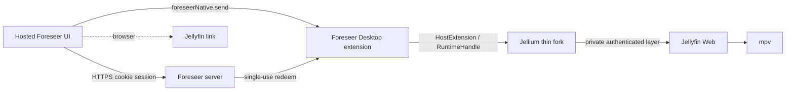

# Foreseer Desktop Integration Plan (protocol v2)

Status: host-extension migration Phases 0–5 implemented in worktrees; Phase 6
gates/docs in progress; Phase 7 Linux acceptance pending.

## Goal

One Foreseer product in two environments:

- **Browser:** full web app; play actions use ordinary Jellyfin links.
- **Foreseer Desktop:** same hosted UI detects `window.foreseerNative` (protocol
  v2), reuses the signed-in user's linked Jellyfin identity, and plays through
  Jellium/mpv in one window. Terminal playback restores the Foreseer route
  without exposing private Jellyfin Web.

Foreseer Desktop + the maintained thin Jellium fork are the supported native
stack. Product stability comes first; upstreaming is opportunistic.

## Non-goals

- Do not move the Foreseer product into Jellium.
- Do not reimplement Jellyfin Web playback negotiation in Foreseer.
- Do not expose mpv, filesystem, shell, CEF handles, or Jellyfin tokens to the
  hosted page.
- Do not make the browser build depend on the desktop binary.
- Do not put Foreseer protocol, origins, tickets, or product JS into Jellium.

## Ownership

| Concern | Owner |
| --- | --- |
| Discovery, requests, library UI, browser fallback | SeerrSuggestArr |
| `window.foreseerNative` detection + ticket issue (`protocolVersion: 2`) | SeerrSuggestArr |
| Protocol v2, controller, injected assets, config, pins | foreseer-desktop |
| CEF/mpv/compositor/window + generic `HostExtension` seam | Jellium thin fork |
| Jellyfin playback negotiation / resume | Jellyfin Web via Jellium private layer |

## Runtime shape

## Protocol v2 (product boundary)

Canonical fixture: [`protocol/protocol-v2.json`](../protocol/protocol-v2.json).

- Global: frozen `window.foreseerNative` with `protocolVersion: 2`,
  `hostName: 'foreseer-desktop'`, and `send(command)`.
- Events: `foreseer:native-event` with `{ protocolVersion, id, type, ... }`.
- Commands are intent-level only (`auth.*`, `play.item`, `session.clear`,
  window/app/setup). No tokens, device IDs, or mpv commands on the page wire.
- Leftover v1 `window.jelliumHost` hosts must fall back to browser playback.
- Resume ticks stay Jellyfin-owned (`startPositionTicksInProtocol: false`).

## Opaque Jellium API (public surface)

Foreseer may import only the `host-extension` exports from `jfn-rust`:

- `HostOptions::with_extension`
- `HostExtension` / `HostExtensionDescriptor`
- `ExtensionSource` / `FrontendSource`
- `Presentation` / `RuntimeEvent` / `RuntimeHandle`
- `jfn_app_main_with`
- related config errors / payload limit constants

Everything else (protocol parsing, auth redeem, setup HTML, product JS) lives in
Foreseer. Stock Jellium with no extension configured must behave as upstream.

## Fork maintenance

- Pin: [`jellium.rev`](../jellium.rev)
- Upstream base: [`jellium.upstream-base`](../jellium.upstream-base)
- Approved commits: [`docs/jellium-patch-manifest.md`](jellium-patch-manifest.md)
- Upgrade steps: [`docs/upgrade-runbook.md`](upgrade-runbook.md)
- Gates: `scripts/boundary-audit.sh`, `scripts/patch-delta.sh`

## Security notes

- Hosted Foreseer is untrusted input even when expected.
- Exact-origin allowlisting and payload size limits stay in the native host.
- Tickets are single-use, short-lived, challenge-bound; never log tokens/tickets.
- Frontend responses must not include access tokens or device IDs.

## Packaging / soak

Linux from-source is the current support surface. Packaged installers and the
Phase 7 Wayland/X11 50-cycle soak remain acceptance gates before calling the
migration complete.
